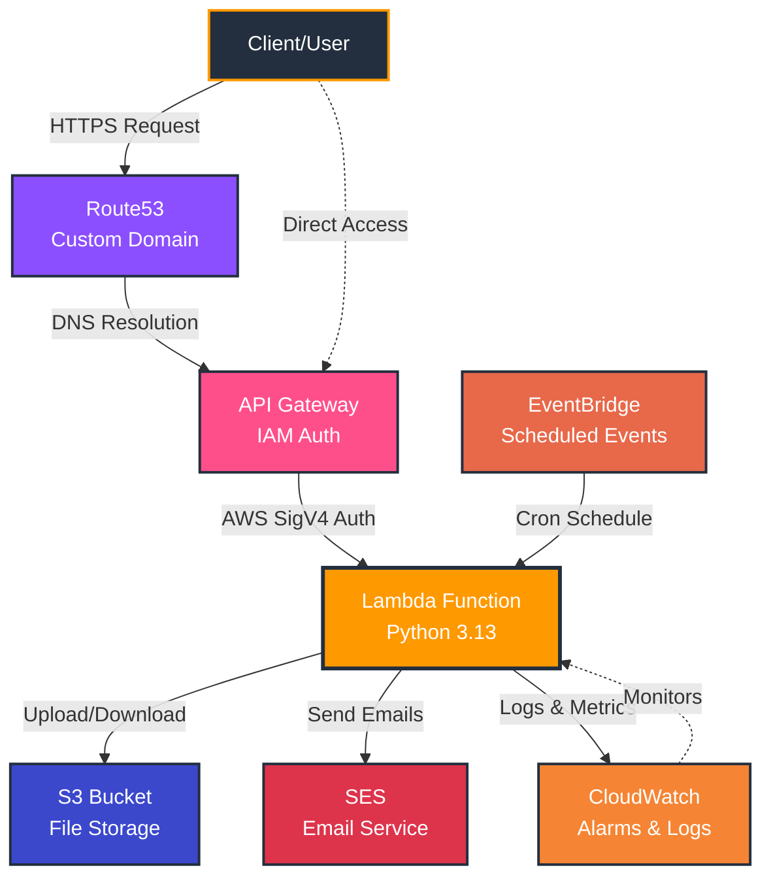
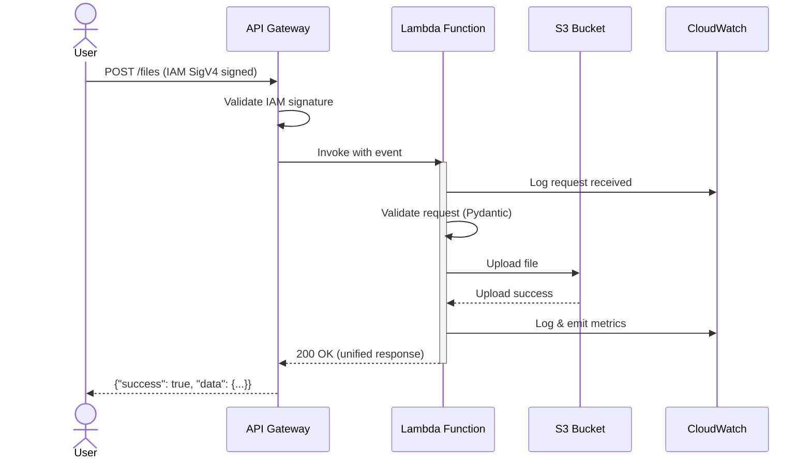
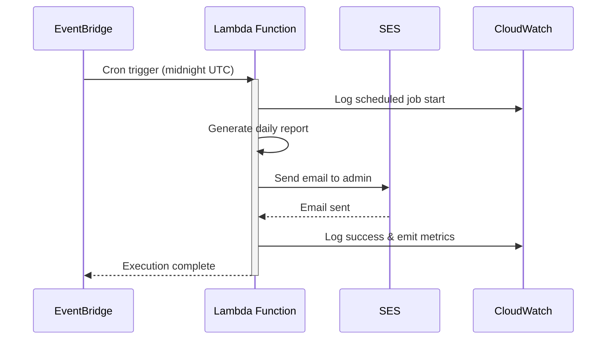

# AWS Lambda + SAM + Powertools Template

A production-ready AWS Lambda template using SAM CLI, AWS Lambda Powertools, and modern Python best practices.

**Not just another "hello world" - this is how you build Lambda functions at scale.**

---

## 🏗️ Infrastructure Flow



**What's Deployed:**

- **API Gateway** - RESTful API with IAM authentication (optional custom domain)
- **Lambda Function** - Python 3.13 with Powertools for logging, tracing, and metrics
- **S3 Bucket** - Encrypted storage with versioning enabled
- **SES** - Email sending capabilities
- **EventBridge** - Scheduled cron jobs (nightly at midnight UTC)
- **CloudWatch** - Alarms for errors and throttles
- **Route53** - DNS management for custom domains (optional)

---

## 📊 Request Flow Diagrams

### API Request Flow (File Upload Example)



### Scheduled Email Flow



---

## 🎯 Why This Template?

Most Lambda templates show you the basics. This one shows you **the right way** - patterns you'd discover after building 10+ production Lambda functions.

### **Key Features**

✅ **Clean Architecture** - Separated concerns: routes, models, business logic, services
✅ **Unified Response Envelope** - Consistent API responses with `@unified_response` decorator
✅ **Pydantic Everywhere** - Type-safe request validation and response serialization
✅ **Exception Handler Registration** - Centralized error handling pattern
✅ **AWS Service Integration** - S3, SES, with full mocking via Moto
✅ **Production Ready** - Structured logging, tracing, metrics, CloudWatch alarms
✅ **98%+ Test Coverage** - Comprehensive test suite with fixtures

---

## 🚀 Quick Start

### **Prerequisites**

- Python 3.13+
- Docker (for SAM local testing)
- AWS SAM CLI
- Pipenv

### **Setup**

```bash
# Install dependencies
pipenv install --dev

# Build the Lambda function
make build

# Run locally (requires Docker)
make start

# Run tests
make test
```

### **Available Make Commands**

**Development:**

```bash
make install-dev        # Install all dependencies
make hooks              # Install pre-commit hooks
make test               # Run pytest with coverage
make lint               # Run all linters (black, isort, flake8)
make build              # Build SAM application
make start              # Start local API Gateway
```

**Deployment:**

```bash
make deploy-sandbox     # Deploy to sandbox (auto-confirm)
make deploy-dev         # Deploy to dev (auto-confirm)
make deploy-prod        # Deploy to prod (requires confirmation)
```

**Invoke Deployed APIs:**

```bash
make invoke-dev ENDPOINT=/hello
make invoke-prod ENDPOINT=/users/123
```

**Teardown:**

```bash
make destroy-sandbox    # Destroy sandbox stack
make destroy-dev        # Destroy dev stack
make destroy-prod       # Destroy prod stack
```

---

## 🏛️ Architectural Highlights

### **1. Clean Code Architecture**

- **`app.py`** = Routes only (no infrastructure noise)
- **`decorators.py`** = Reusable response wrappers
- **`exceptions.py`** = Centralized error handling with registration pattern
- **`models.py`** = Pydantic request/response contracts
- **`helper.py`** = Business logic & domain models

**Why?** At 2am when production is down, you want to scan routes, not wade through 2000 lines of mixed concerns.

### **2. Unified Response Envelope**

Every endpoint returns a consistent structure:

```json
{
  "success": true,
  "data": { "your": "response" },
  "error": null
}
```

**Implementation:** One decorator (`@unified_response`) wraps all successful responses. Exception handler wraps all errors. Zero boilerplate in your routes.

### **3. Pydantic Everywhere**

- **Request validation** - Automatic via Powertools + Pydantic
- **Response serialization** - Type-safe with `.model_dump()`
- **Domain models** - Business logic with validation
- **No raw dicts** - Everything is typed and validated

### **4. Exception Handler Registration Pattern**

```python
# app.py - Clean!
register_exception_handlers(app)

# exceptions.py - All error handling logic
def register_exception_handlers(app):
    @app.exception_handler(AppException)
    def handle_app_exception(ex):
        return format_error_response(ex)
```

**Why?** As you scale to 10+ exception types, this pattern keeps `app.py` focused on business logic.

### **5. AWS Service Integration with Mocking**

- **`services/storage.py`** = Clean S3 abstraction layer
- **Full mocking with Moto** = Test AWS services without AWS
- **Reusable test fixtures** = DRY testing patterns

```python
# Production code - simple and clean
storage = get_storage_service()
storage.upload_file(content, key="uploads/file.pdf")

# Tests - fully mocked, no AWS needed
def test_upload(mock_s3_bucket):
    storage = get_storage_service()
    storage.upload_file(b"test", "file.txt")
    assert storage.file_exists("file.txt")
```

---

## 📁 Project Structure

```
.
├── src/
│   ├── app.py              # Routes only (clean!)
│   ├── decorators.py       # @unified_response decorator
│   ├── exceptions.py       # Custom exceptions + handler registration
│   ├── models.py           # Pydantic request/response models
│   ├── helper.py           # Business logic & domain models
│   └── services/           # AWS service integrations
│       ├── storage.py      # S3 service
│       ├── email.py        # SES service
│       ├── dynamodb.py     # DynamoDB service
│       └── sqs.py          # SQS service
├── tests/
│   ├── conftest.py         # Shared fixtures
│   ├── test_handler.py     # Endpoint tests
│   └── fixtures/           # JSON event fixtures
├── scripts/
│   └── call_api.py         # IAM-authenticated API client (AWS SigV4)
├── docs/                   # 📚 Additional documentation
│   ├── DEVELOPMENT.md      # Complete setup & deployment guide
│   ├── EMAIL_SETUP.md      # SES configuration guide
│   ├── SERVICES.md         # AWS services usage guide
│   ├── SCRIPTS.md          # Helper scripts documentation
│   └── SAMCLI_README.md    # SAM CLI reference
├── template.yaml           # SAM/CloudFormation template
├── samconfig.toml          # Multi-environment configuration
├── Pipfile                 # Dependency management
├── makefile                # Build & test commands
└── env.json.example        # Local environment variables
```

---

## 🛠️ Technology Choices

### **Pipenv > pip + venv**

- ✅ **Deterministic builds** - `Pipfile.lock` ensures same versions everywhere
- ✅ **Separate dev deps** - `--dev` flag for test/lint tools
- ✅ **Automatic venv management** - No manual activation
- ✅ **Security scanning** - Built-in `pipenv check`

### **AWS Lambda Powertools**

Not using Powertools? You're rebuilding features AWS already built:

- **Structured logging** with correlation IDs
- **Distributed tracing** with X-Ray
- **Custom metrics** to CloudWatch
- **Request validation** with Pydantic
- **Type-safe event handling** for API Gateway

---

## 🧪 Testing & Quality

### **Comprehensive Test Suite**

- **98%+ code coverage** (enforced in CI)
- **Fixture composition** via `conftest.py`
- **Mock Lambda context** for realistic testing
- **AWS service mocking** with Moto (no AWS costs)

```bash
make test  # Run all tests with coverage
```

### **Linting & Code Quality**

Pre-configured with **pre-commit hooks**:

- **black** - Opinionated code formatter
- **isort** - Import statement organizer
- **flake8** - Style guide enforcement
- **autopep8** - PEP 8 auto-formatting
- **pyupgrade** - Python syntax modernization (3.9+)

```bash
make lint  # Run all linters
```

---

## 🎨 Key Features

### **1. Health Check Endpoint**

```python
@app.get("/health")
@unified_response
def health_check() -> dict[str, Any]:
    return {"status": "healthy", ...}
```

Ready for load balancers, monitoring tools, and uptime checks.

### **2. Structured Error Responses**

```python
raise NotFoundError(
    "User not found",
    resource_type="User",
    resource_id="123"
)
```

Returns:

```json
{
  "success": false,
  "data": null,
  "error": {
    "type": "NotFoundError",
    "message": "User not found",
    "details": {"resource_type": "User", "resource_id": "123"}
  }
}
```

### **3. EventBridge Scheduled Events**

Lambda supports both API calls and scheduled execution:

```yaml
Events:
  ApiEvent:
    Type: Api
  NightlySchedule:
    Type: Schedule
    Properties:
      Schedule: "cron(0 0 * * ? *)"
```

### **4. CloudWatch Alarms**

Pre-configured alarms for:

- Lambda errors (>1 error in 5 minutes)
- Lambda throttles (>5 throttles in 5 minutes)

---

## 🔧 Configuration

### **Local Development**

1. Copy `env.json.example` to `env.json`
2. Update environment variables
3. Run `make start`

### **Deployment**

```bash
# Build
sam build --use-container

# Deploy
sam deploy --guided
```

---

## 📚 Documentation

Complete guides available in `/docs`:

- **[DEVELOPMENT.md](docs/DEVELOPMENT.md)** - Complete setup guide, environment variables, CI/CD, troubleshooting
- **[EMAIL_SETUP.md](docs/EMAIL_SETUP.md)** - SES configuration and email service usage
- **[SERVICES.md](docs/SERVICES.md)** - AWS service integrations guide (S3, SES, DynamoDB, SQS)
- **[SCRIPTS.md](docs/SCRIPTS.md)** - Helper scripts documentation
- **[SAMCLI_README.md](docs/SAMCLI_README.md)** - SAM CLI reference

---

## 🏗️ Production Readiness

### **What's Included**

✅ Structured logging with correlation IDs
✅ Distributed tracing (X-Ray)
✅ Custom metrics to CloudWatch
✅ Error monitoring with alarms
✅ Health check endpoint
✅ Request validation
✅ Type safety throughout
✅ 98%+ test coverage
✅ Scheduled event support
✅ Pre-configured IAM roles

### **What You Need to Add**

- Database connection (DynamoDB, RDS, etc.)
- Authentication/Authorization
- Rate limiting
- CORS configuration (if needed)
- API Gateway custom domain

---

## 🤝 Contributing

This is a **template repository** - fork it and make it your own!

### **Philosophy**

- **Opinionated but flexible** - Strong defaults, easy to customize
- **Production patterns** - Not just "hello world"
- **Educational** - Comments explain WHY, not just WHAT
- **Maintainable** - Code you can hand off at 2am

---

## 📝 License

MIT - Use it however you want!

---

## 🙏 Credits

Built with:

- [AWS SAM CLI](https://aws.amazon.com/serverless/sam/)
- [AWS Lambda Powertools for Python](https://awslabs.github.io/aws-lambda-powertools-python/)
- [Pydantic](https://docs.pydantic.dev/)
- [Pytest](https://pytest.org/)

---

**Questions? Issues? Fork it and make it better!** 🚀
